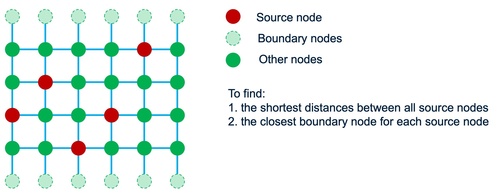

# Dijkstra_grid
### Overview
Given a graph and group of source nodes, compute the shortest distances between the source nodes via Dijkstra.


The example text files include:

- 'dijkstraGRAPHin.txt': the graph, with format:
```
<number of nodes> <number of edges>
<node id> <node id> <edge weight>
<node id> <node id> <edge weight>
...
```
- 'dijkstraSOURCEin.txt': the source nodes (including boundary nodes), with format:
```
<number of source nodes> <number of boundary nodes>
<node id>
<node id>
...
```
- 'dijkstraGRAPHout.txt': the result output, with format:
```
<number of nodes> <number of edges>
<node id> <node id> <edge weight>
<node id> <node id> <edge weight>
...
```

### Usage
Compile 'dijkstraX.cpp' into executable, eg. 'dijkstraX'.

As an example, to use, `./dijkstraX -e dijkstraGRAPHin.txt -s dijkstraSOURCEin.txt -w dijkstraGRAPHout.txt`
